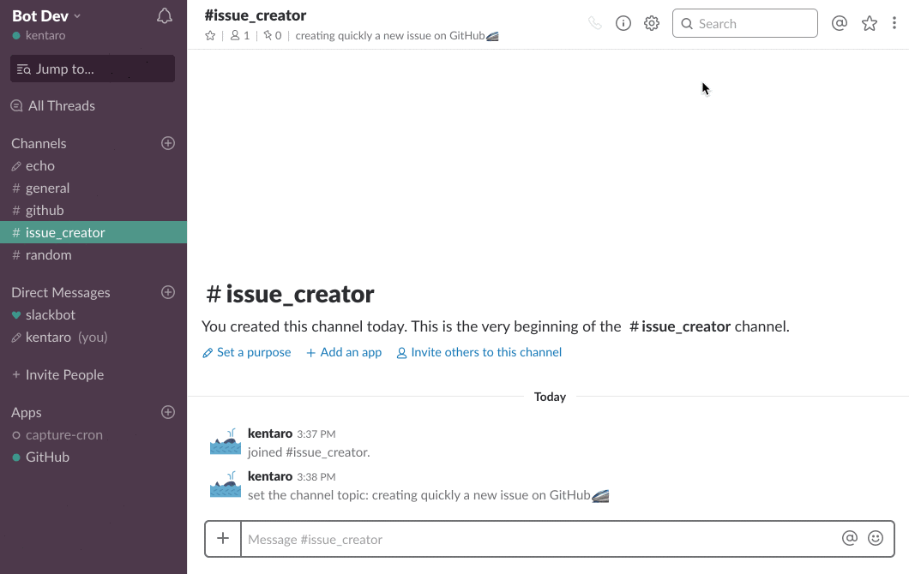

# :bullettrain_side: Issue Creator
WIP:construction_worker: A Slack slash command for creating quickly a new issue on GitHub.

## :arrow_forward: Usage
Create a new issue on GitHub repository you set up when the "issue_creator" command executes on the Slack channel.

```
/issue_creator [issue title]
```



## :floppy_disk: Installation

### Generate the GitHub Token
Move to [New personal access token](https://github.com/settings/tokens/new) and create a token with `repo` scope.

### Create the Slack slash command
1. Move to [Slack API: Applications | Slack](https://api.slack.com/apps) and click to "Create New App".
2. Input your application name and select your slack workspace for running the application.
3. Select "Slash Commands" of the "Add features and functionality" section.
4. Press the "Create New Command".
5. Input Command, Request URL, Short Description and Usage Hint (Please refer to the list below).
6. Press the "Save" button.
7. Move to [Slack API: Applications | Slack](https://api.slack.com/apps) and select the application you created.
8. Press the "Install App to Workspace" of the "Install your app to your workspace" section.

#### A description of configuration the Slack slash command
* `Command` A name of the slash command.
* `Request URL` A url of receive a POST request when the command is executed (you will change it later, so let's put in an any value).
* `Short Description` A description of the slash command.
* `Usage Hint` A usage example of parameters to be input after the command.

### Install dependencies
```bash
$ npm install
```

### Update the configuration file
Update the configuration file (`config/default.json`).
```
{
  "github": {
    "baseUrl": "", // option: An endpoint for GitHub API if using GitHub Enterprise (default: empty). e.g. https://githubenterprise.com/api/v3
    "repoOwner": "", // required: A repository owner name where a new issue is created.
    "repoName": "" // required: A repository name where a new issue is created.
  },
  "users": [ // required: A list of users who are allowed to execute slash command and assigned to the issue.
    {
      "slack": "john",
      "github": "john"
    },
    {
      "slack": "debra",
      "github": "debra"
    },
    {
      "slack": "alex",
      "github": "alex"
    },
    {
      "slack": "kentaro",
      "github": "kentaro"
    }
  ]
}
```

### Create the deployment package
Create the Amazon S3 bucket to upload the deployment package.
```bash
$ aws s3 mb s3://<bucket-name> --region <region-name>
```

Create the deployment package using `sam` command.

NOTE: You can use `aws cloudformation` command instead of `sam` command.
```bash
$ sam package \
     --template-file template.yml \
     --output-template-file serverless-output.yml \
     --s3-bucket <s3-bucket-name>
```

### Deploy
Deploy the application using `sam` command.

After the deployment is complete, move to the CloudFormation console and check the value of the `RequestURL` in the output section.

Please update the value of `Request URL` on Slack slash command configuration page.

NOTE: You can use `aws cloudformation` command instead of `sam` command.
```bash
$ sam deploy \
   --template-file serverless-output.yml \
   --stack-name <new-stack-name> \
   --parameter-overrides GitHubToken=<token> \ 
   --capabilities CAPABILITY_IAM
```
## :memo: License
MIT